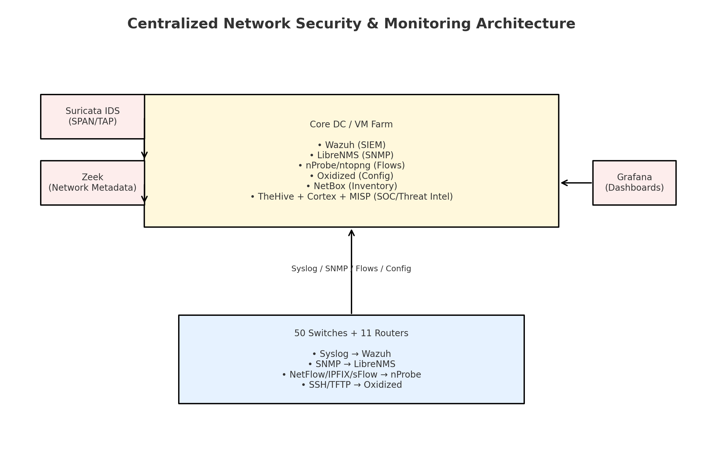
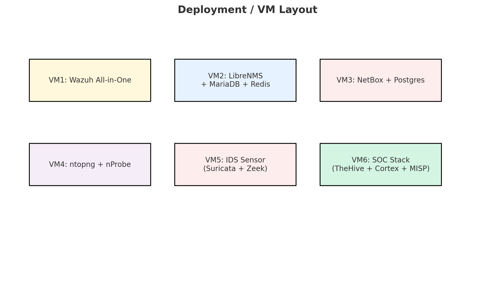
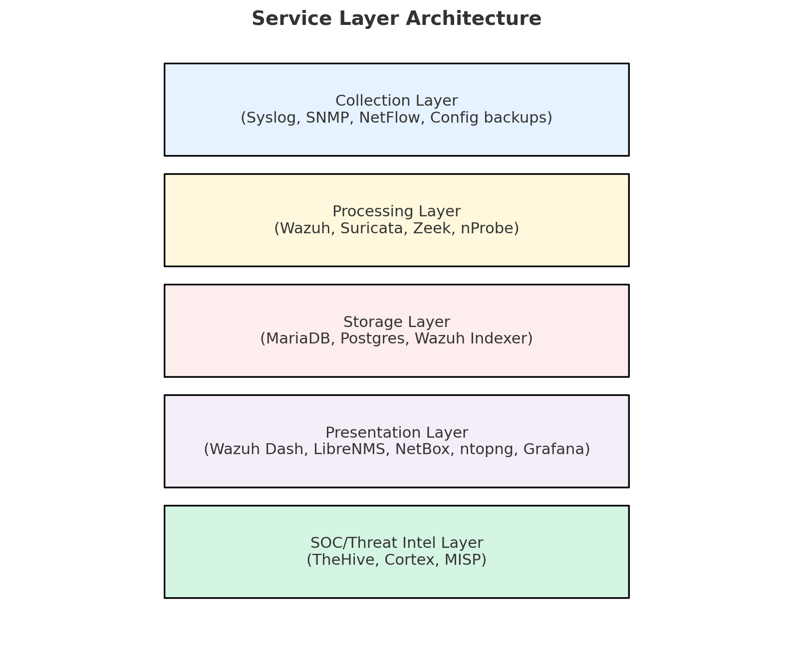
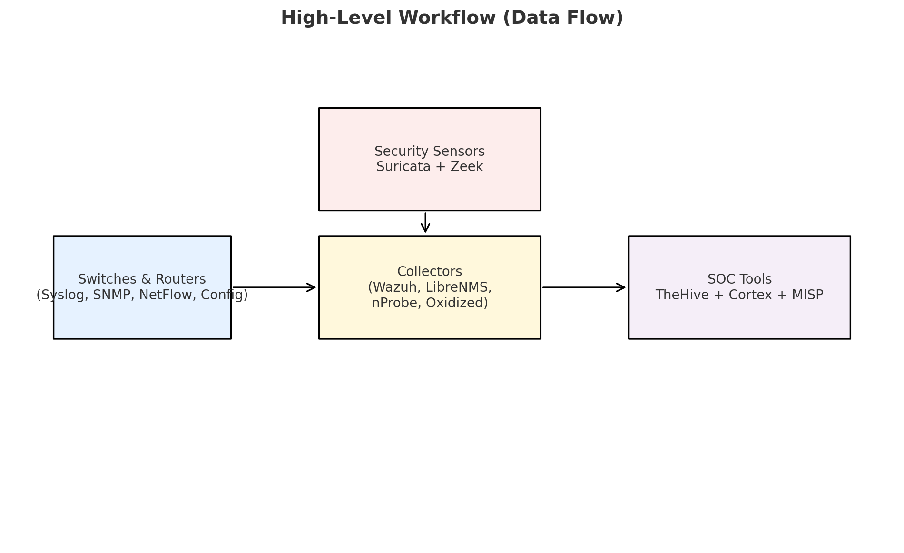

🛡️ NetSec Monitoring Stack (Docker)

Centralized **network & security monitoring** for ~50 switches and 11 routers.  
Provides a single pane of glass for **logs, flows, SNMP metrics, configuration backups, threat intel, dashboards, and SOC workflows**.

---

## ✨ Features

### 🔐 Security & Analytics
- **Wazuh SIEM**
  - Collects and correlates syslogs from all switches/routers
  - Alerts on failed logins, config changes, link flaps, and SFP DDM alarms
  - Built-in dashboards and compliance reporting

- **Suricata IDS**
  - Real-time intrusion detection on mirrored traffic
  - Detects malware, port scans, DDoS attempts, protocol anomalies

- **Zeek (Bro)**
  - Provides rich network metadata (DNS, HTTP, TLS, SMTP)
  - Helps in forensic analysis and anomaly detection

---

### 📡 Network Monitoring & Telemetry
- **LibreNMS**
  - Auto-discovery of devices via SNMP
  - Graphs of bandwidth, errors, and interface utilization
  - Threshold-based alerts for device health and links

- **NetFlow/IPFIX with nProbe + ntopng**
  - Collects NetFlow/sFlow/IPFIX from routers and switches
  - Dashboards for top talkers, apps, ASNs, protocols
  - Detects traffic anomalies and misuse

---

### 🗂 Inventory & Configuration
- **NetBox (IPAM/DCIM)**
  - Source of truth for IP addresses, racks, sites, devices
  - Helps track network documentation centrally

- **Oxidized**
  - Automated backup of router/switch configs via SSH
  - Version control with diffing between config changes
  - Easy restore on device failures

---

### 🛠 SOC & Threat Intel
- **TheHive**
  - Case management platform for SOC incidents
  - Collaboration between NOC/SOC teams

- **Cortex**
  - Automates enrichment (IP reputation, file hash lookups, etc.)

- **MISP (Malware Information Sharing Platform)**
  - Feeds threat intel into Wazuh and Suricata
  - IOC sharing between internal teams

---

### 📊 Visualization & Reporting
- **Wazuh Dashboard** → security alerts, compliance reports
- **LibreNMS** → SNMP health and network maps
- **ntopng** → traffic flow analytics
- **Grafana** → unified dashboards across metrics/logs/flows

---

## 🏗️ Architecture (High Level)



---

## 🖼 Visual Overview

### Deployment Overview


### Layered Architecture


### Workflow Diagram


---

## 📂 Project Structure

```
netsec-monitoring-stack/
├── .env                       # Global env (versions, ports, defaults)
├── .gitignore                 # Git ignore file
├── Makefile                   # helper make targets
├── README.md                  # This file
├── INSTALL.md                 # Installation guide
│
├── compose/                   # Docker Compose per service
│   ├── docker-compose.core.yml
│   ├── docker-compose.flows.yml
│   ├── docker-compose.ids.yml
│   ├── docker-compose.soc.yml
│   ├── docker-compose.ti.yml
│   └── docker-compose.grafana.yml
│
├── env/                       # service-specific environment files
│   └── ...
│
├── configs/                   # configs for each tool
│   └── ...
│
├── ansible/                   # automation
│   └── ...
│
├── runbooks/                  # operational docs
│   └── ...
│
└── scripts/
    └── init.sh
```

---

## 🚀 Quick Start

1. **Prepare environment**
   - Ubuntu Server 24.04 with Docker & Docker Compose installed
   - Clone this repo to your server

2. **Run the setup script**
   ```bash
   ./scripts/init.sh
   ```

   This will automate the entire setup process, including configuration and service startup.


---

## 📚 Documentation

*   **[Administrator Guide](runbooks/administrator_guide.md):** Instructions for adding new devices and systems to the monitoring stack.
*   **[User Guide](runbooks/user_guide.md):** Information for end-users on how to access and use the different tools.

---

## 🖥️ Access Points

* **Wazuh Dashboard** → `http://<server-ip>:5601`
* **LibreNMS** → `http://<server-ip>:8000`
* **NetBox** → `http://<server-ip>:8001`
* **ntopng** → `http://<server-ip>:3000`
* **Oxidized** → `http://<server-ip>:8888`
* **TheHive** → `http://<server-ip>:9000`
* **Cortex** → `http://<server-ip>:9001`
* **MISP** → `https://<server-ip>:8443`

---

## 🛠 Device Integration

* **Syslog** → forward to Wazuh on TCP/1514
* **SNMP** → point to LibreNMS SNMP collector
* **NetFlow/IPFIX** → export to nProbe on UDP/2055
* **SSH/TFTP** → allow Oxidized for config backups

---

## 📚 Runbooks

* `runbooks/onboarding-checklist.md` → steps to add a new device
* `runbooks/incident-handling.md` → playbook for SFP DDM alarm

---

## 🔐 Security Notes

* Always use **SNMPv3** where possible
* Replace all default passwords in `.env` and `env/*.env`
* Protect UIs behind **HTTPS + LDAP/SSO**
* Regularly back up Docker volumes & configs

```

🔮 Future Development Roadmap
Milestone 1 — Infrastructure Hardening

Add Traefik reverse proxy for HTTPS and domain-based routing.

Integrate Docker secrets / Vault for strong secret management.

Enable central logging of all containers.

Milestone 2 — Automation

Build Ansible playbooks to auto-onboard devices:

Syslog → Wazuh

SNMP → LibreNMS

NetFlow → nProbe

SSH creds for Oxidized

NetBox API integration to enforce source of truth before onboarding.

Milestone 3 — Security Operations

Deploy Suricata/Zeek sensors in pilot mode.

Tune detection rules, ingest into Wazuh.

Build alert → case automation in TheHive.

Milestone 4 — NOC Operations

Finalize LibreNMS alert policies (CPU, RAM, interface flaps).

Validate Oxidized backups and version diffs.

Standardize Grafana dashboards for bandwidth & security.

Milestone 5 — Collaboration & CI/CD

Add pre-commit hooks (yamllint, markdownlint).

Enable GitHub/GitLab CI for automated lint & deploy checks.

Write runbooks for NOC (infra issues) and SOC (incident handling).

Package all diagrams into docs/ (PNG + PDF + PPTX).

📖 Documentation & Runbooks

runbooks/ contains operator guides.

docs/ (to be created) will store diagrams, PDF architecture, and user manuals.

📜 License

MIT License – free for internal + commercial use.

---

👉 this **README** now has:  
- features ✅  
- repo structure ✅  
- run instructions ✅  
- team practices ✅  
- **future roadmap** ✅  

Do you want me to also prepare a **TEAM_ONBOARDING.md** (like a handbook: setup dev env, git workflow, coding standards) so your teammates can jump in quickly?


